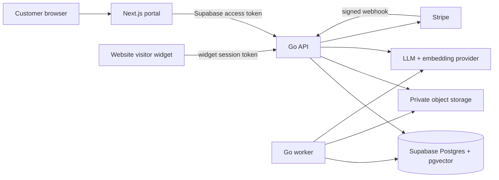

# Garuda implementation and integration contract

Status: implementation target for the frontend and Go backend. This document is the source of truth when a mock UI and API implementation disagree.

## 1. Product decision and MVP boundary

Garuda is a multi-tenant SaaS for creating and embedding an AI sales/support chatbot. The intended journey is:

1. A user creates an account with email/password.
2. The user buys the Garuda plan through Stripe.
3. A conversational onboarding flow asks three or four business questions.
4. Garuda generates a draft agent. The user previews, edits, and explicitly publishes it.
5. The user copies one widget snippet to an approved website.
6. The widget answers from the agent's knowledge, asks for contact details at an appropriate point, and records a lead after explicit consent.
7. A returning visitor is recognized only by an opaque, agent-scoped browser token and can resume the same conversation/memory.
8. The customer sees agents, conversations, and leads in the portal.

The concrete pricing decision for this implementation is **USD 17 per month, recurring**. The amount and interval shown in the app must come from the server's configured Stripe Price, not from a client-provided amount. If the intended offer is a one-time $17 kit, change the Stripe Checkout mode and entitlement policy before launch; do not mix both interpretations in one build.

The data model supports multiple agents per organization. The initial $17 entitlement may limit an organization to one published agent, 100 conversations per billing period, and five knowledge sources; these values are configuration, not hard-coded product promises.

Not in the initial MVP: voice calls, WhatsApp, CRM/listing-feed integrations, ad generation, appointment booking, custom domains, agency/reseller billing, or the earlier $17 order-bump/$147 service funnel. They can be added behind the same organization and agent model.

## 2. System shape



- Frontend: Next.js App Router, TypeScript, Tailwind, and shadcn/ui. Marketing pages may be static; authenticated pages should be server-rendered where practical and then hydrated.
- Backend: Go HTTP service with a small router such as `chi`, `pgx` for PostgreSQL, provider adapters for AI/Stripe/storage, and a separate worker process built from the same repository.
- Identity: Supabase Auth for email/password, email verification, refresh, and password reset. Supabase is not the authorization layer for organization resources; the Go API performs membership and role checks too.
- Data: Supabase Postgres with `pgvector`. Private source files live in a private storage bucket. The browser never receives a service-role key.
- Async work: a Postgres-backed jobs/outbox table using `FOR UPDATE SKIP LOCKED` is sufficient for MVP ingestion, agent generation, memory summarization, and webhook follow-up. Deploy the worker separately so slow AI work never blocks HTTP requests.

Recommended production origins:

- `https://www.garuda.example` — marketing
- `https://app.garuda.example` — portal
- `https://api.garuda.example` — Go API
- `https://widget.garuda.example` — immutable/versioned widget assets and iframe

Local defaults can be `http://localhost:3000` and `http://localhost:8080`.

## 3. Frontend routes and gates

| Route | Purpose | Gate |
|---|---|---|
| `/` | Marketing and plan CTA | Public |
| `/auth/sign-up` | Supabase email/password signup | Signed-out |
| `/auth/sign-in` | Login | Signed-out |
| `/auth/forgot-password` | Request a reset email | Public |
| `/auth/reset-password` | Consume reset link and set password | Recovery session |
| `/auth/callback` | PKCE/email callback; no UI beyond errors | Public callback |
| `/checkout` | Plan summary and Checkout CTA | Authenticated, not entitled |
| `/checkout/success` | “Confirming payment”; polls `/v1/me` briefly | Authenticated |
| `/app/onboarding` | Three/four-question conversational setup | Active entitlement, incomplete onboarding |
| `/app` | Overview/usage/recent leads | Active entitlement, onboarded |
| `/app/agents` | Agent list and create action | Active entitlement |
| `/app/agents/new` | Create an additional agent when the plan permits | Active entitlement |
| `/app/agents/[agentId]` | Configure, knowledge, preview, publish, install | Active entitlement + tenant ownership |
| `/app/widget` | Widget install instructions and live preview shortcut | Active entitlement, onboarded |
| `/app/conversations` | Search/list conversations | Active entitlement |
| `/app/conversations/[id]` | Transcript and linked lead | Active entitlement + tenant ownership |
| `/app/leads` | Lead table and status updates | Active entitlement |
| `/app/billing` | Subscription status and portal link | Authenticated |
| `/app/settings` | Organization/profile/privacy settings | Authenticated |

Routing rules:

- Middleware may optimize redirects, but each page and every API call must enforce its own authorization. Middleware is not a security boundary.
- `/v1/me` is the canonical bootstrap call. It tells the frontend which gate to apply.
- A Stripe success URL is not proof of payment. `/checkout/success` waits for webhook-derived entitlement and offers a retry/contact path after a short timeout.
- An expired or `past_due` subscription leaves billing and account settings available and makes product data read-only during any configured grace period.
- “No loading” cannot literally be guaranteed across auth/network/AI calls. Target an SSR-rendered shell, prefetched navigation, cached lists, optimistic small updates, and skeletons only where data is genuinely pending. Suggested SLOs are portal LCP under 2.5 seconds at p75, ordinary API reads under 300 ms at p95, and AI first token under 2 seconds at p75 when the provider is healthy.

## 4. HTTP conventions

Portal API base: `${API_ORIGIN}/v1`  
Widget API base: `${API_ORIGIN}/widget/v1`

Portal requests use:

```http
Authorization: Bearer <supabase_access_token>
X-Organization-ID: <uuid>        # optional for the one-org MVP; always membership-checked
X-Request-ID: <uuid>             # optional; server creates one if absent
Idempotency-Key: <uuid>          # required on checkout, publish, complete, and lead capture
```

After widget bootstrap, widget writes use `X-Garuda-Session-Token`; this credential is distinct from and much narrower than a Supabase token.

The backend validates token signature, issuer, audience, expiry, and `sub` locally against cached Supabase JWKS. It resolves organization membership from `sub`; it never accepts a user ID or organization ID in a resource request body as authority.

Successful JSON responses use a stable envelope:

```json
{
  "data": {},
  "meta": { "next_cursor": null }
}
```

Errors use:

```json
{
  "error": {
    "code": "validation_failed",
    "message": "One or more fields are invalid.",
    "request_id": "req_01...",
    "details": { "email": "invalid email" }
  }
}
```

- IDs are UUID strings, times are RFC 3339 UTC strings, money is integer minor units plus a lowercase currency code, and omitted optional values are `null` rather than magic strings.
- Cursor pagination is `?limit=25&cursor=<opaque>`. Maximum `limit` is 100. Do not expose page-number queries over large message tables.
- Use `400` malformed request, `401` unauthenticated/expired, `402 subscription_required`, `403` valid identity without permission, `404` missing or cross-tenant resource, `409` state/idempotency conflict, `412` stale revision, `422` semantic validation, `429` rate limit, and `503` provider temporarily unavailable.
- Return `404`, not `403`, when an otherwise valid resource ID belongs to another tenant.
- Important creates accept an `Idempotency-Key`; message writes additionally contain a stable client-generated message ID. Store the key, request hash, status, and response for safe retries.
- Never place prompts, chat bodies, access tokens, visitor tokens, email addresses, or phone numbers in URLs or logs.

## 5. Portal API contract

### Bootstrap and account

`GET /v1/me`

```json
{
  "data": {
    "user": { "id": "uuid", "email": "owner@example.com", "name": "Asha" },
    "organization": { "id": "uuid", "name": "Acme Realty", "role": "owner" },
    "organizations": [{ "id": "uuid", "name": "Acme Realty", "role": "owner" }],
    "subscription": {
      "status": "active",
      "plan_code": "starter_17",
      "current_period_end": "2026-09-29T00:00:00Z",
      "cancel_at_period_end": false,
      "entitled": true,
      "limits": { "published_agents": 1, "monthly_conversations": 100, "knowledge_sources": 5 }
    },
    "onboarding": { "status": "in_progress", "answered": 2, "required": 4, "completed_at": null }
  }
}
```

The first authenticated request may lazily create one organization and owner membership in a single transaction. Repeated calls must be idempotent.

`PATCH /v1/profile`

```json
{ "name": "Asha Singh" }
```

### Billing

`GET /v1/billing/subscription` returns the same subscription object as `/v1/me`, plus Stripe invoice/portal-safe display fields.

`POST /v1/billing/checkout-sessions`

```json
{ "return_path": "/checkout/success" }
```

```json
{
  "data": {
    "session_id": "cs_...",
    "url": "https://checkout.stripe.com/..."
  }
}
```

The API ignores/rejects client-supplied amount, currency, Price, Customer, organization metadata, `mode`, and success URL. It selects the configured `$17/month` Price and allowlisted return origin server-side.

`POST /v1/billing/portal-sessions`

```json
{ "return_path": "/app/billing" }
```

Only an organization owner may create this session. The server selects the organization's Stripe Customer.

`POST /v1/webhooks/stripe` is public but signature-authenticated. It is not under browser CORS and must receive the exact raw body.

### Conversational onboarding

The conversational UI is backed by a deterministic state machine; the LLM may word a question and extract an answer, but it may not skip required fields or invent completion. Ask no more than four core questions:

1. `business_profile`: business name, website if any, and what it offers.
2. `primary_outcome`: answer questions, qualify leads, recommend an offer, or book/contact handoff.
3. `audience_and_offer`: ideal visitor and the important product/service information.
4. `voice_and_capture`: tone, bot name, fields to request, and when a human should take over.

`GET /v1/onboarding`

```json
{
  "data": {
    "id": "uuid",
    "status": "in_progress",
    "answers": {
      "business_profile": "Acme Realty sells new homes in Noida.",
      "primary_outcome": "qualify_leads"
    },
    "messages": [],
    "current_question": {
      "id": "audience_and_offer",
      "prompt": "Who is your ideal buyer, and which properties should the assistant discuss?",
      "input_hint": "For example: first-time buyers seeking 2–3 bedroom homes..."
    },
    "progress": { "answered": 2, "required": 4 }
  }
}
```

`POST /v1/onboarding/messages`

```json
{
  "client_message_id": "uuid",
  "content": "Mostly first-time buyers looking for 2 or 3 bedroom homes."
}
```

```json
{
  "data": {
    "user_message": { "id": "uuid", "content": "Mostly first-time buyers..." },
    "assistant_message": { "id": "uuid", "content": "Great. How should your assistant sound..." },
    "accepted_answer": { "field": "audience_and_offer", "value": "Mostly first-time buyers..." },
    "current_question": { "id": "voice_and_capture", "prompt": "How should your assistant sound..." },
    "progress": { "answered": 3, "required": 4 },
    "ready_to_complete": false
  }
}
```

`POST /v1/onboarding/complete` returns `202`:

```json
{
  "data": {
    "job": { "id": "uuid", "type": "generate_agent", "status": "queued" },
    "agent": { "id": "uuid", "name": "Acme Assistant", "status": "generating" }
  }
}
```

It requires all four validated answers, an active entitlement, and an idempotency key. Generation creates a draft only. Poll `GET /v1/jobs/{jobId}` until `succeeded` or `failed`.

### Agents

`GET /v1/agents?limit=25&cursor=...` returns summary objects.  
`POST /v1/agents` creates a blank draft when the plan allows it.  
`GET /v1/agents/{agentId}` returns the full editable draft, public/publish state, usage summary, and knowledge-source summary.

Canonical agent shape:

```json
{
  "id": "uuid",
  "organization_id": "uuid",
  "name": "Acme Assistant",
  "status": "draft",
  "revision": 3,
  "config": {
    "identity": { "bot_name": "Avi", "business_name": "Acme Realty" },
    "instructions": "Help visitors understand available homes. Never invent availability or price.",
    "tone": "warm_professional",
    "welcome_message": "Hi — how can I help with your home search?",
    "suggested_prompts": ["Show me 2 bedroom options", "Can someone call me?"],
    "fallback_message": "I do not have enough information to answer that. I can take your details for the team.",
    "lead_capture": {
      "enabled": true,
      "timing": "after_value",
      "fields": ["name", "email", "phone"],
      "required_fields": ["email"]
    },
    "handoff": { "enabled": true, "message": "I’ll ask the team to follow up." }
  },
  "widget": {
    "accent_color": "#F97316",
    "position": "bottom_right",
    "launcher_label": "Ask Garuda",
    "privacy_url": "https://acme.example/privacy",
    "allowed_domains": ["acme.example", "www.acme.example"]
  },
  "published": null,
  "created_at": "2026-08-29T10:00:00Z",
  "updated_at": "2026-08-29T10:10:00Z"
}
```

`PATCH /v1/agents/{agentId}` uses JSON Merge Patch semantics for `name`, `config`, and `widget`. Send `If-Match: "3"`; a stale revision returns `412 stale_revision` with the current revision. The backend validates colors, URL schemes, supported field enums, prompt lengths, and domains.

`POST /v1/agents/{agentId}/preview/messages`

```json
{ "client_message_id": "uuid", "content": "Do you have a 2 bedroom home?", "preview_session_id": null }
```

It runs against the editable draft, is authenticated and rate-limited, and returns either normal JSON or the same SSE events as the widget. Preview messages never appear as real visitors/leads and are tagged as non-billable or separately metered.

`POST /v1/agents/{agentId}/publish` returns:

```json
{
  "data": {
    "status": "published",
    "published_version": 1,
    "published_at": "2026-08-29T10:20:00Z",
    "agent_key": "pub_live_<random>",
    "embed_code": "<script async src=\"https://widget.garuda.example/v1.js\" data-agent-key=\"pub_live_...\"></script>"
  }
}
```

Publishing snapshots an immutable `agent_version`; live chats must never read a half-edited draft. `POST /v1/agents/{agentId}/unpublish` prevents new sessions without destroying history.

### Knowledge sources

`GET /v1/agents/{agentId}/sources` lists sources and ingestion status.  
`POST /v1/agents/{agentId}/sources` accepts JSON text or URL:

```json
{ "type": "url", "name": "Pricing FAQ", "url": "https://acme.example/faq" }
```

or

```json
{ "type": "text", "name": "Sales notes", "text": "Our sales office is open..." }
```

`POST /v1/agents/{agentId}/sources/upload` accepts multipart file upload within the plan's type/size limits. It returns `202` with a job and source in `queued` state. For larger production files, replace this with a short-lived signed private-storage upload and finalize call without changing the source model.

`DELETE /v1/agents/{agentId}/sources/{sourceId}` removes the source and its chunks asynchronously. Published behavior should stop retrieving deleted chunks immediately by marking the source unavailable before deletion.

Source status is `queued | processing | ready | failed | deleting`. A failure contains a safe user-facing code/message, never provider internals or extracted private text.

### Conversations and leads

`GET /v1/conversations?agent_id=&status=&query=&limit=&cursor=` returns redacted summaries.  
`GET /v1/conversations/{conversationId}` returns transcript, page/referrer metadata, memory status, and a linked lead if authorized.  
`PATCH /v1/conversations/{conversationId}` accepts `{ "status": "closed" }`.

`GET /v1/leads?agent_id=&status=&query=&limit=&cursor=`  
`GET /v1/leads/{leadId}`  
`PATCH /v1/leads/{leadId}` accepts only portal-managed fields:

```json
{ "status": "qualified", "notes": "Interested in Sector 150." }
```

Lead status is `new | qualified | contacted | converted | disqualified`. Lead profile fields supplied by visitors are changed through a separate audited operation if later required; the generic patch must not allow `organization_id`, `agent_id`, consent, or source attribution changes.


### Team replies

`POST /v1/conversations/{conversationId}/messages` accepts `{ "content": "..." }`,
1 to 4,000 **characters** (counted in runes, not bytes — a byte cap is roughly a
third of that in most non-Latin scripts). The reply is stored with role
`assistant` and `metadata.author = "operator"`, so the widget renders it without
change and the model reads it as its own prior turn rather than contradicting
what a person just said.

`404 conversation_not_found` covers both a missing conversation and one in
another workspace, as everywhere else.

### Visitor journey

Every conversation summary and detail may carry a `journey` object. It is absent
for a session recorded before tracking existed, and for a visitor whose browser
did not report — both mean "we do not know", never "they did nothing".

```json
{
  "source": {
    "channel": "direct|organic|paid|social|email|referral|campaign",
    "referrer_domain": "google.com",
    "landing_path": "/pricing",
    "utm_source": "google", "utm_medium": "cpc", "utm_campaign": "launch",
    "click_id_kind": "google|meta"
  },
  "device": { "form": "mobile|tablet|desktop", "language": "en-GB",
              "timezone": "Asia/Kolkata", "region": "India" },
  "region_is_approximate": true,
  "pages": [{ "path": "/pricing", "title": "Pricing",
              "arrived_at": "2026-08-30T00:05:45Z", "seconds": 95 }],
  "page_count": 7, "pages_truncated": false, "engaged_seconds": 310,
  "first_seen_at": "...", "last_seen_at": "..."
}
```

`channel` may be an empty string when a batch of pages arrived before any source
batch; render that as unrecorded rather than inventing a channel.

`region` is derived from the browser's own IANA time zone, **not** an IP lookup,
so it is approximate by construction. `region_is_approximate` travels in the
payload rather than living only in the UI, so any consumer inherits the caveat.

`pages_truncated` means older entries were dropped past the per-session cap;
`page_count` still counts every page seen, so the total stays honest.

---

## 6b. Widget journey, handoff, replies and booking

All four require a live session token in `X-Garuda-Session-Token`. None of them
is reachable with only an `agent_key`.

`POST /widget/v1/sessions/{sessionId}/activity` — one batch of journey
observations. `204 No Content`.

```json
{
  "source": { "referrer": "...", "landing_path": "/pricing",
              "utm_source": "...", "utm_medium": "...", "utm_campaign": "...",
              "utm_term": "...", "utm_content": "...",
              "google_click": true, "meta_click": false },
  "device": { "viewport_width": 390, "language": "en-GB", "timezone": "Asia/Kolkata" },
  "pages": [{ "path": "/pricing", "title": "Pricing", "seconds": 42 }]
}
```

`source` and `device` are sent once, on the first batch of a visit; a later batch
omits them and the stored values are left alone, so an internal navigation cannot
overwrite the referrer that brought the visitor to the site. At most 20 pages per
batch and 50 kept per session, oldest dropped. The server strips query strings
from paths, keeps only the host of a referrer, and stores a click id as a boolean
rather than a value. **`google_click` and `meta_click` are booleans, never ids.**

Re-reporting the page a visitor is still on, with a larger `seconds`, updates it
in place. Reporting a page after visiting others is a new entry, because the
order is the story.

`POST /widget/v1/sessions/{sessionId}/handoff` — hands the visitor a WhatsApp
link to the site owner. `200` with `{ channel, url, label, availability }`.
`404 handoff_unavailable` when the agent does not offer one.

**The owner's number never appears in the widget bootstrap.** The bootstrap is a
public document served to every allowed origin; it carries only
`handoff: { enabled, channel, label, availability, trigger_phrases,
auto_offer_after }`. The number becomes a `wa.me` link only inside this endpoint,
which first proves the caller holds a live session.

`GET /widget/v1/sessions/{sessionId}/messages?after={messageId}` — anything the
visitor's transcript does not already hold, so a team reply reaches an open
panel. The cursor is a **message id, not a timestamp**: two messages written in
the same millisecond are indistinguishable by time, and a cursor that cannot
separate them either repeats one or drops one. An unknown cursor returns the
tail, not the whole transcript.

`POST /widget/v1/sessions/{sessionId}/voice` — a visitor speaking instead of
typing. Raw audio body, `Content-Type: audio/webm` or similar, at most 1MB.

```json
{ "text": "how much does a survey cost", "language": "en" }
```

**It transcribes and does not send.** The visitor sees what was heard and presses
send, and the message then travels the ordinary chat path with its own rate
limit, quota and lead-capture rules. Speech recognition is wrong sometimes, and a
misheard sentence sent to somebody's business is worse than an extra tap.

Errors a client must handle: `402 subscription_required` and
`503 voice_unavailable` both mean voice is not available here and the visitor
should type — neither is their fault and neither should be shown as an error
about them. Also `413 audio_too_large`, `422 audio_too_short`,
`422 no_speech_detected`, `429 voice_quota_exceeded`,
`503 transcription_unavailable`.

The audio is **not stored**. It is a recording of somebody speaking on a
stranger's website, it is not needed once it is words, and keeping it would mean
holding a voice sample nobody agreed to give us.

`GET /widget/v1/sessions/{sessionId}/slots` — free times from the customer's own
connected Google Calendar.

```json
{ "slots": [{ "start": "2026-09-03T09:00:00Z", "end": "2026-09-03T09:30:00Z",
              "label": "Thu 3 Sep, 14:30", "day": "Thu 3 Sep",
              "time": "14:30", "minutes": 30 }],
  "timezone": "Asia/Kolkata", "duration_minutes": 30 }
```

`start` and `end` are RFC3339 UTC; `label`, `day` and `time` are already rendered
in the **owner's** time zone. Clients must display the rendered strings and not
reformat, or a visitor in another country is shown a time the owner never
offered.

`POST /widget/v1/sessions/{sessionId}/booking` accepts
`{ "start", "name", "email", "notes" }` where `start` is a slot's `start`
verbatim. `201` with `{ booked, start, minutes, timezone }`.

- `409 slot_taken` — the owner took that time between it being offered and
  chosen. The slot is re-checked against the calendar at booking time rather than
  trusted, because double-booking a real person is the one outcome this must not
  produce.
- `503 calendar_not_connected` — the customer has not connected a calendar. This
  is the owner's problem, not the visitor's; clients must not present it as the
  visitor's mistake.
- `502 calendar_unavailable` — the provider could not be reached.

A booking also creates a lead with source `appointment`, so an owner does not
read two lists to find out somebody booked.

### Website import

`POST /v1/agents/{agentId}/sources/fetch` accepts `{ "url": "..." }` and returns
`{ url, title, text, truncated, characters }` **for review**. It does not save.
The existing `POST /v1/agents/{agentId}/sources` saves the reviewed text.

Two steps on purpose: a page whose text came out as a cookie banner and a
navigation menu is something the customer should be able to reject before their
agent starts answering from it.

`422 url_not_allowed` covers every refused address — non-https, private,
loopback, link-local, credentials in the URL, or a redirect into any of those.
The message must not describe what is or is not reachable from the server.

### Appointments

`GET /v1/appointments?scope=upcoming|past|all&agent_id=`

```json
{ "appointments": [{
    "id": "lead_…", "lead_id": "lead_…", "agent_id": "agt_…", "agent_name": "Priya",
    "session_id": "cvs_…", "starts_at": "2026-09-03T09:00:00Z", "minutes": 30,
    "timezone": "Asia/Kolkata", "calendar": "googlecalendar",
    "calendar_label": "Google Calendar", "name": "…", "email": "…", "phone": "…",
    "notes": "…", "status": "new", "booked_at": "…" }],
  "upcoming_count": 3, "past_count": 11,
  "reflects_changes_made_in_the_calendar": false }
```

This is what **Garuda booked**, not a mirror of the customer's calendar. It reads
from the lead recorded against each booking rather than from the providers: one
read instead of an API call per connected calendar, no per-provider failure mode,
and it still answers after a calendar is disconnected.

`reflects_changes_made_in_the_calendar` is always false and is in the payload
deliberately — an appointment moved or cancelled inside the customer's own
calendar is not reflected here, because nothing tells us, and any consumer should
inherit that caveat rather than take it from our UI.

`calendar` is recorded on the booking, not looked up from the agent, so switching
provider does not relabel last week's appointments.

### What an integration is for

`GET /v1/integrations/roles`

```json
{ "roles": [{ "toolkit": "slack", "capability": "notify", "label": "Slack",
              "use_case": "Your team gets a message the moment a lead is captured…",
              "setting_label": "Channel", "setting_hint": "…",
              "partial": false }],
  "calendars": [{ "toolkit": "cal", "label": "Cal.com",
                  "setting_label": "Event type ID", "books_in_chat": true }] }
```

Capability is one of `calendar`, `leads`, `notify` — the only three things this
product sends elsewhere. **An app absent from `roles` can still be connected and
nothing is wired to it**; the screen must say so and point at the outbound
webhook, which reaches everything else without per-provider code. Showing the
catalogue as though all of it receives leads is the failure this endpoint exists
to prevent.

`partial` marks a job the provider only half supports, with `partial_note`
explaining it — Calendly completing its booking on its own page, for instance.

### Choosing a calendar

`model.BookingConfig` carries `calendar` (a toolkit slug) and `calendar_setting`.

- **One calendar per agent.** An agent stands for one job, and "when are you
  free" has to have a single answer.
- An empty `calendar` means `googlecalendar`, which is what it meant when the
  field did not exist.
- `calendar_setting` is the single value a provider needs beyond the connection —
  a Cal.com event type id, a Calendly event URL. Saving an enabled booking whose
  calendar is missing it is refused with detail key `booking.calendar_setting`.
- Free/busy providers (Google, Outlook) are inverted against the owner's working
  day by us. Scheduling providers (Cal.com, Calendly) are asked what is bookable
  and their answer is taken, because they already own availability rules the
  customer configured there.

---

## 6. Public widget contract

An `agent_key` is a publishable identifier, not a secret. It can identify a published agent and load public presentation settings; it can never authorize portal data.

`GET /widget/v1/agents/{agent_key}` returns only the published display/bootstrap configuration (name, welcome message, prompts, theme, privacy URL, and whether memory/lead capture are enabled). It does not return instructions, source content, tenant metadata, usage, or history.

### Bootstrap

The loader executes on the host page, reads an opaque token from host `localStorage` under a key scoped to the agent, and calls `POST /widget/v1/sessions`. It then passes only the returned short-lived session material into the Garuda iframe using a target-origin-restricted `postMessage`.

```json
{
  "agent_key": "pub_live_<random>",
  "visitor_token": "optional_opaque_256_bit_token",
  "page": {
    "url": "https://acme.example/properties/green-heights",
    "title": "Green Heights",
    "referrer": "https://www.google.com/"
  },
  "locale": "en-IN",
  "consent": { "memory": true, "analytics": true }
}
```

```json
{
  "data": {
    "session_id": "uuid",
    "session_token": "short_lived_signed_token",
    "expires_at": "2026-08-29T11:00:00Z",
    "visitor_token": "opaque_token_to_store",
    "conversation": {
      "id": "uuid",
      "resumed": true,
      "messages": [
        { "id": "uuid", "role": "assistant", "content": "Welcome back...", "created_at": "..." }
      ]
    },
    "agent": {
      "display_name": "Avi",
      "welcome_message": "Hi — how can I help?",
      "suggested_prompts": [],
      "accent_color": "#F97316",
      "position": "bottom_right",
      "privacy_url": "https://acme.example/privacy"
    }
  }
}
```

The raw visitor token is generated once and only its HMAC-SHA-256 digest is stored. It is high entropy and scoped to one agent. The backend rejects a token issued for any other agent. If memory consent is false, create an ephemeral visitor, return no persistent visitor token, and do not use cross-session memory.

Resume policy: resume the most recent open conversation for the same verified visitor and agent if activity is within 30 days; otherwise create a new conversation and, with consent, provide the model a bounded summary of earlier conversations. Never let a caller select a visitor, conversation, organization, or agent version by UUID.

The widget session token is signed, expires in roughly 15 minutes, and binds `agent_id`, `agent_version_id`, `visitor_id`, `conversation_id`, and origin. Refresh is allowed only through the same valid visitor token/origin bootstrap flow.

### Streaming chat

`POST /widget/v1/sessions/{sessionId}/messages` uses `X-Garuda-Session-Token: <widget_session_token>` and:

```json
{
  "client_message_id": "uuid",
  "content": "Can someone call me about a 2 bedroom home?"
}
```

With `Accept: text/event-stream`, emit:

```text
event: message.start
data: {"message_id":"uuid"}

event: message.delta
data: {"text":"I can help with that. "}

event: lead.form
data: {"fields":["name","email","phone"],"required_fields":["email"],"reason":"follow_up_requested"}

event: message.done
data: {"message_id":"uuid","conversation_id":"uuid"}
```

An error before streaming uses the standard JSON envelope. An error after headers uses `event: error` with a safe code, then closes. `?stream=false` may return a single JSON assistant message for tests/accessibility fallback.

Limits at the boundary: UTF-8 text only, 4,000 characters per visitor message, 50 recent messages exposed to the UI, server-enforced token/context limits, one active generation per conversation, and idempotent replay by `client_message_id`.

### Explicit lead capture

The model may request a deterministic form; it must not silently turn incidental PII in chat into marketing consent. The widget posts a completed form to `POST /widget/v1/sessions/{sessionId}/leads` using `X-Garuda-Session-Token`:

```json
{
  "client_capture_id": "uuid",
  "name": "Ravi Kumar",
  "email": "ravi@example.com",
  "phone": "+919810000000",
  "company": null,
  "custom_fields": { "property_type": "2 bedroom" },
  "consent": {
    "contact": true,
    "privacy_policy": true,
    "captured_at": "2026-08-29T10:34:00Z"
  }
}
```

It returns `201` with `{ "data": { "lead_id": "uuid", "status": "new" } }`. Replaying the same `client_capture_id` returns the original result. The backend normalizes email/phone and may merge into an existing lead only within the same organization and agent while still recording the new capture event and consent evidence.

## 7. Data model and tenant isolation

Every business row has a non-null `organization_id`, including data that could otherwise be reached through an agent. Recommended tables:

| Table | Essential fields / rule |
|---|---|
| `profiles` | `user_id` references `auth.users`; display-only profile data |
| `organizations` | `id`, `name`, `created_by`, timestamps |
| `organization_members` | `(organization_id, user_id)` unique; `owner | admin | member | viewer` |
| `subscriptions` | one current row per org; Stripe customer/subscription/price IDs, normalized status, period, entitlements |
| `onboarding_sessions` | org, status, answers JSON, question/message history, generated agent |
| `agents` | org, draft config, revision, state, public key, current published version |
| `agent_versions` | immutable org/agent/version snapshot and publish timestamp |
| `knowledge_sources` | org/agent, type, private storage key or canonical URL, checksum, state, failure code |
| `knowledge_chunks` | org/agent/source, bounded text, token count, metadata, `tsvector`, embedding vector |
| `visitors` | org/agent, visitor-token digest, consent flags/times, first/last seen; no fingerprint |
| `conversations` | org/agent/version/visitor, state, origin/page/referrer, timestamps |
| `messages` | org/conversation, role, text, tool state, provider/model IDs, timestamps |
| `visitor_memories` | org/agent/visitor, bounded summary/facts, consent and expiry |
| `leads` | org/agent/visitor/conversation, normalized PII, custom fields, status, source, timestamps |
| `lead_capture_events` | lead/conversation, consent evidence, field provenance; append-only |
| `usage_events` | org/agent, metric, quantity, billing-period key, idempotency reference |
| `jobs` | org where applicable, type, payload reference, status, attempts, lease, safe error |
| `stripe_events` | Stripe event ID unique, type, Stripe-created time, processing state/error |
| `idempotency_keys` | scope + key unique, request hash, response/status, expiry |
| `audit_logs` | org, actor, action, resource, safe metadata, timestamp; append-only |

Isolation controls are cumulative:

1. Verify the Supabase JWT and resolve membership server-side.
2. Require a `TenantID` argument in every Go repository method. All object reads/updates include both `id` and `organization_id` predicates.
3. Add unique `(organization_id, id)` keys and composite foreign keys such as `(organization_id, agent_id)` so a child cannot reference a parent in another tenant.
4. Enable and `FORCE ROW LEVEL SECURITY` on tenant tables. At transaction start, set a transaction-local `app.current_organization_id`; policies use it in both `USING` and `WITH CHECK`. Never reuse a connection with a session-level tenant setting.
5. Use a non-owner, non-`BYPASSRLS` database role for normal API/worker queries. Give webhook/provisioning maintenance a separate narrowly granted role instead of using the Supabase service role everywhere.
6. Background jobs carry an organization ID, validate that their referenced resource belongs to it, set the tenant context, and then process.
7. Widget code derives organization and agent solely from a validated public key/session token. A widget request never accepts `organization_id`.

The frontend may use Supabase directly only for Auth. Business tables are accessed through Go, avoiding two divergent authorization implementations.

## 8. Authentication, Stripe, and application security

### Supabase Auth

- Use PKCE and an allowlisted callback URL. Verify email before paid onboarding unless product policy explicitly allows otherwise.
- Use Supabase's server-side/SSR cookie integration; do not manually persist access or refresh tokens in `localStorage`.
- Password-reset responses are identical whether an email exists. Reset links are short-lived and redirect only to an allowlisted origin.
- Verify JWTs locally with cached/rotated JWKS and strict issuer/audience; never decode without verification and never trust email/role claims as organization authorization.
- Revoke/refresh sessions on password change according to Supabase settings. Apply rate limits to signup, login adjunct endpoints, checkout creation, and reset requests.
- If cookies ever authenticate the Go API directly, add CSRF tokens and strict `SameSite`/Origin checks. Bearer-token portal calls must allow only configured app origins in CORS.

### Stripe

- Create/reuse exactly one Stripe Customer per organization. Store `organization_id` in Customer, Checkout Session, and Subscription metadata, but verify it against database mappings when processing.
- Checkout mode is `subscription`; the configured Price is selected server-side. Do not accept raw price/customer/URL fields from the browser.
- Verify `Stripe-Signature` against the exact raw request body and the environment-specific webhook secret before JSON parsing. Enforce a reasonable timestamp tolerance.
- Insert the Stripe event ID under a unique constraint before processing. A replay returns `2xx` without reapplying state.
- Handle at minimum `checkout.session.completed`, `customer.subscription.created`, `customer.subscription.updated`, `customer.subscription.deleted`, `invoice.paid`, and `invoice.payment_failed`.
- Webhooks may arrive late or out of order. For subscription state changes, retrieve the current Subscription from Stripe or compare authoritative object/version timestamps before overwriting newer state.
- Entitlement is granted only for `active` or `trialing`. Define a short read-only grace state for `past_due` if desired. `incomplete`, `incomplete_expired`, `unpaid`, and `canceled` cannot publish or start new live chats.
- A redirect or client-side `session_id` never grants access. Secrets and webhook payloads are redacted from logs.

### Widget and API hardening

- Validate browser `Origin` against exact normalized allowed domains during bootstrap. Dynamic CORS echoes only a matched origin; never use wildcard with credentials/tokens. Origin is abuse friction, not sole authentication, because non-browser clients can spoof it.
- Layer rate limits by agent, IP prefix, visitor, conversation, and organization entitlement. Add a challenge/block path for bursts and cap concurrent model calls.
- Render assistant output as sanitized restricted Markdown or plain text. Forbid raw HTML, JavaScript URLs, event attributes, and unsandboxed embeds. Apply a strict iframe CSP and `sandbox`; validate every `postMessage` origin.
- Do not use device fingerprinting. Visitor identity is the high-entropy opaque token plus consent. Provide per-agent memory reset and deletion controls.
- Validate and normalize PII server-side, mask it in logs/analytics, restrict dashboard roles, and define retention/deletion/export policy before public launch. Application-level encryption for lead fields is advisable if threat/compliance requirements justify searchable-field tradeoffs.
- URL ingestion permits only HTTP/HTTPS, resolves DNS, blocks loopback/private/link-local/cloud-metadata ranges, revalidates every redirect, and caps redirects, bytes, MIME types, and duration. File ingestion checks magic bytes, size, archive expansion, and malware policy before extraction.
- Secrets live in the deployment secret manager. No service-role, Stripe, LLM, database, widget-signing, or storage secret uses a `NEXT_PUBLIC_` name.

## 9. Agent generation, RAG, and memory

Do not “train a model” per customer in the MVP. Generate a structured agent configuration and use retrieval-augmented generation:

1. Onboarding extraction uses structured JSON constrained to the four canonical answers. Validate enum/length/domain values in Go.
2. Generation creates a draft configuration: identity, system instructions, welcome text, suggested prompts, lead form policy, fallback, and handoff policy. It must preserve user facts and mark uncertain fields for review rather than invent them.
3. Publishing creates an immutable version. A live conversation remains pinned to the version it started with for reproducibility.
4. Ingestion extracts text, removes boilerplate, chunks semantically (roughly 400–800 tokens with modest overlap), stores source/page metadata, creates embeddings, and builds full-text search data.
5. Runtime retrieval is hybrid vector + full-text search, filtered in SQL by `organization_id`, `agent_id`, ready source, and the applicable published corpus/version. Retrieve a small top-k, apply a minimum relevance threshold/rerank if available, and answer with “I don't know”/handoff when evidence is weak.
6. The prompt clearly marks retrieved documents and visitor text as untrusted data. Neither may override system policy or authorize a tool call. Never put tenant secrets or hidden operational prompts in retrieved context.
7. Tools are a typed, allowlisted registry. In the MVP the safest tool is `request_lead_form`; the API, not the model, validates and persists the form. Future CRM/calendar tools require per-tenant credentials, narrow scopes, confirmation for side effects, idempotency, and audit logs.
8. Persist the completed response and usage even if the browser disconnects. Time out/cancel runaway provider calls, retry only safe failures with jitter, and return a deterministic fallback when the provider is unavailable.

Memory has two layers:

- Short-term: the latest bounded messages in the current conversation.
- Long-term: a compact summary and a small allowlist of user-provided preferences/facts for the same verified visitor and agent, only with memory consent.

Summarize asynchronously when a token/message threshold is crossed. Do not embed entire visitor transcripts or include unrelated PII in long-term memory. Give memory a retention expiry, refresh it on consensual use, and support “forget me” by deleting visitor tokens, memory, conversations, and/or leads according to the published privacy policy. A visitor token from agent A must never retrieve memory for agent B, even in the same organization.

Use a provider interface in Go (`Chat`, `StreamChat`, `Embed`) so models can be swapped and tested. A large agent framework is not required for this bounded pipeline; if LangChain/LangGraph is introduced later, it must preserve the same tenant filters, typed tools, audit trail, and API contract.

## 10. Deployment and operations

Suggested managed deployment:

- Next.js portal: Vercel (or another platform with full App Router support).
- Go API and worker: Google Cloud Run, Fly.io, or Render as separate services/images. Keep an always-available minimum instance if cold starts violate the widget SLO.
- Data/Auth/Storage: one Supabase project per environment, Postgres connection pooling, `pgvector`, private buckets, point-in-time recovery for production.
- Widget assets: versioned immutable files on a CDN. Keep the tiny loader backwards compatible and load a pinned internal bundle/iframe version.
- Observability: structured JSON logs with request/job IDs, OpenTelemetry traces, error monitoring, provider latency/error/usage metrics, webhook lag, queue age, and tenant-safe audit logs. Never log chat/PII by default.

Minimum environment configuration:

```text
# Frontend (public values only)
NEXT_PUBLIC_APP_URL
NEXT_PUBLIC_API_URL
NEXT_PUBLIC_SUPABASE_URL
NEXT_PUBLIC_SUPABASE_ANON_KEY

# API / worker secrets
DATABASE_URL
SUPABASE_JWT_ISSUER
SUPABASE_JWT_AUDIENCE
SUPABASE_JWKS_URL
STRIPE_SECRET_KEY
STRIPE_WEBHOOK_SECRET
STRIPE_PRICE_ID_STARTER_17
LLM_API_KEY
LLM_CHAT_MODEL
LLM_EMBEDDING_MODEL
WIDGET_SESSION_SIGNING_KEY
VISITOR_TOKEN_HMAC_KEY
APP_ALLOWED_ORIGINS
WIDGET_ASSET_ORIGIN
STORAGE_BUCKET
```

Use separate test/staging/production keys, databases, Stripe products/webhooks, storage, signing keys, and origins. CI should run formatting, static analysis, unit tests, migration checks, frontend type/lint/build, backend race-aware tests where practical, contract tests, and a staging smoke test. Apply expand/contract migrations before the new application revision; never run destructive schema changes automatically on startup. Exercise database restore, signing-key rotation, webhook replay, and rollback procedures before launch.

## 11. Production truthfulness

| Capability | Can be real in the initial implementation when configured | Demo/scaffold until additional work is completed |
|---|---|---|
| UI/navigation | Responsive Next/shadcn portal, SSR shell, accessible forms | Hard-coded charts/metrics or fake “instant” transitions are demo data |
| Auth | Supabase signup/login/verify/reset/session handling | Without a real Supabase project and redirect/email setup, screens alone are not auth |
| Billing | Real Checkout, portal, signed/idempotent webhooks, entitlement gates | A local success button/mock webhook never proves billing readiness |
| Agent creation | Structured onboarding, draft generation, edit/preview/publish | Without an LLM key, generated copy/replies are fixtures; call this demo mode visibly |
| RAG | Real private ingestion, pgvector retrieval, tenant-filtered citations/fallback | Seeded FAQ answers or keyword matching are a demo, not customer-grounded AI |
| Widget | Real embed, secure session, persisted chat, returning visitor, lead form | A portal-only preview/localStorage transcript is not an embeddable production widget |
| Multi-tenancy | Composite tenant constraints, RLS, repository scoping, IDOR tests | Merely adding `organization_id` columns is not isolation |
| Operations | Backups/PITR, alerting, queue retry/DLQ, limits, runbooks, privacy deletion | A passing local build is not production readiness |

Before calling the service production-ready, it also needs real domain/email configuration, legal privacy/terms/cookie decisions for launch jurisdictions, retention policy, support/incident ownership, abuse handling, cost/quota policy compatible with a $17 plan, accessibility review, dependency/security scanning, load tests, backup restore evidence, and provider outage behavior.

## 12. Integration and acceptance checklist

### Contract and local integration

- [ ] Frontend uses one configured API base and the response/error envelopes above; no component imports backend-only secrets or invents tenant IDs.
- [ ] Backend CORS permits the exact portal origin and widget bootstrap dynamically permits only an agent's normalized allowed domains.
- [ ] Mock frontend fixtures match `/v1/me`, agent, conversation, lead, and SSE shapes exactly and can be replaced with the real client without component rewrites.
- [ ] OpenAPI/contract tests cover every implemented route, status code, enum, and nullability; unknown response fields are tolerated, required fields are enforced.
- [ ] API and UI builds pass from a clean checkout with documented environment examples.

### End-to-end happy path

- [ ] Sign up → verify email → sign in → `/v1/me` creates one organization/owner exactly once.
- [ ] Checkout uses the configured Price; valid webhook changes entitlement; success redirect alone does not.
- [ ] Onboarding accepts four answers, safely retries a duplicated message/complete request, generates one draft, and never auto-publishes.
- [ ] Customer edits, previews, publishes, adds an allowed domain, and copies an embed snippet.
- [ ] Widget loads on that domain, streams a grounded reply, shows the explicit lead form, and the lead/conversation appears in the correct portal.
- [ ] Closing and reopening as the same visitor resumes memory; clearing/denying memory creates an unrelated visitor and exposes no earlier content.

### Auth, tenancy, and billing abuse

- [ ] Missing, expired, wrong-issuer, wrong-audience, and invalid-signature JWTs return `401`.
- [ ] For every agent/source/conversation/lead route, organization A cannot read/update/delete organization B's known UUID; response is `404`.
- [ ] An organization B child row cannot reference an organization A parent at the database level.
- [ ] Viewer/member/admin/owner permissions are tested, especially billing, export, publish, member management, and deletion.
- [ ] Client-supplied Stripe Price, amount, currency, Customer, organization metadata, and return-host values are rejected/ignored.
- [ ] Invalid webhook signature changes nothing; duplicate event applies once; older/out-of-order event cannot overwrite current subscription state; cancellation/payment failure gates correctly.
- [ ] Checkout/session/publish/onboarding idempotency is safe under concurrent retries.

### Widget, memory, and lead security

- [ ] Invalid/unpublished agent keys and disallowed origins fail; a key never returns private config, sources, leads, or conversations.
- [ ] Forged, expired, wrong-origin, wrong-agent, and cross-conversation widget session tokens fail.
- [ ] A stolen/guessed visitor UUID is useless; only the high-entropy opaque token resumes history. Token digests, not raw tokens, are stored.
- [ ] Visitor A cannot see visitor B history; agent A memory cannot appear in agent B; no-consent sessions leave no long-term memory token/summary.
- [ ] Duplicate messages and lead captures create one logical record. Concurrent model generations are bounded.
- [ ] XSS payloads in visitor text, source content, agent fields, and model output render inert. `postMessage`, iframe CSP/sandbox, and Markdown links are tested.
- [ ] Message/field/URL/file limits, origin validation, rate limits, challenge/block path, and entitlement quotas are enforced server-side.
- [ ] Lead consent evidence is stored, PII is absent from logs/URLs, and delete/export/forget behavior is verified.

### AI and RAG

- [ ] Retrieval always filters by organization, agent, ready source, and published corpus/version before ranking.
- [ ] A prompt-injection instruction inside a source or user message cannot reveal system prompts, select another tenant, or invoke an unauthorized tool.
- [ ] Supported test questions retrieve the expected source; low-relevance questions use the configured uncertainty/fallback response instead of hallucinating.
- [ ] Deleted sources stop being retrieved immediately; failed ingestion is visible and retryable without duplicate chunks.
- [ ] Provider timeout, stream disconnect, rate limit, malformed structured output, and partial job failure have bounded retry/fallback behavior and do not lose usage/message state.
- [ ] Model/token/embedding usage is attributed once to the correct organization and billing period.

### Operations and quality

- [ ] Unit, repository integration, handler, race/concurrency, frontend accessibility, contract, and browser E2E tests run in CI.
- [ ] p75/p95 portal/API/widget first-token SLOs and a realistic concurrent-chat load test pass within the $17-plan cost assumptions.
- [ ] Logs/traces/alerts connect request → job → provider call without recording secrets or message/lead content.
- [ ] Production migration forward/rollback, database restore, webhook replay, worker dead-letter/retry, and key rotation have been exercised in staging.
- [ ] Privacy/terms/retention/consent copy reflects actual behavior and launch jurisdictions; the product does not claim “trained on your data” when it uses RAG.

## 13. Handoff rule

If frontend and backend work independently, lock these items before styling more screens: route names, auth header, response/error envelopes, state enums, `/v1/me`, agent shape, onboarding message shape, SSE event names, and widget bootstrap/lead payloads. A generated UI may use fixtures, but fixtures must conform to this document and be visibly identified as demo data. Any intentional deviation should update this document and both clients in the same change.
